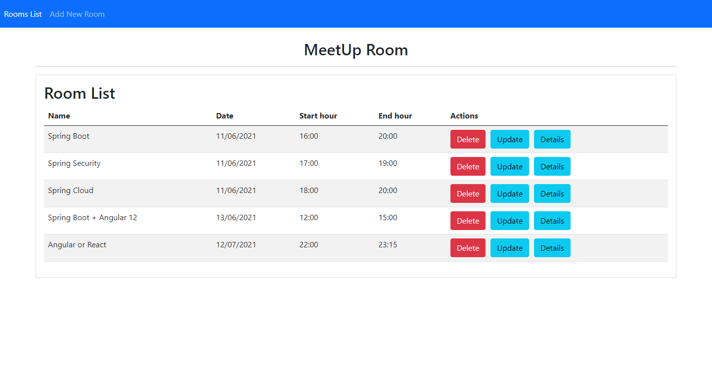
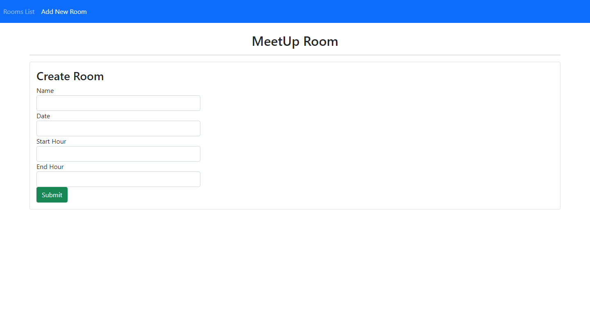
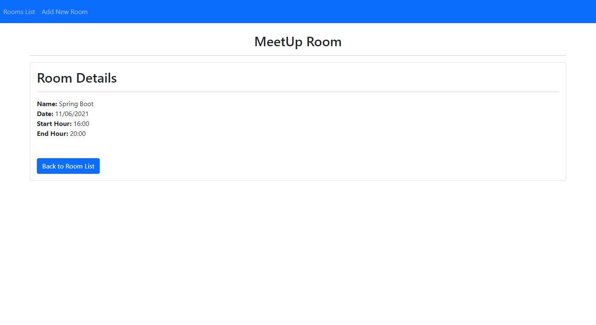
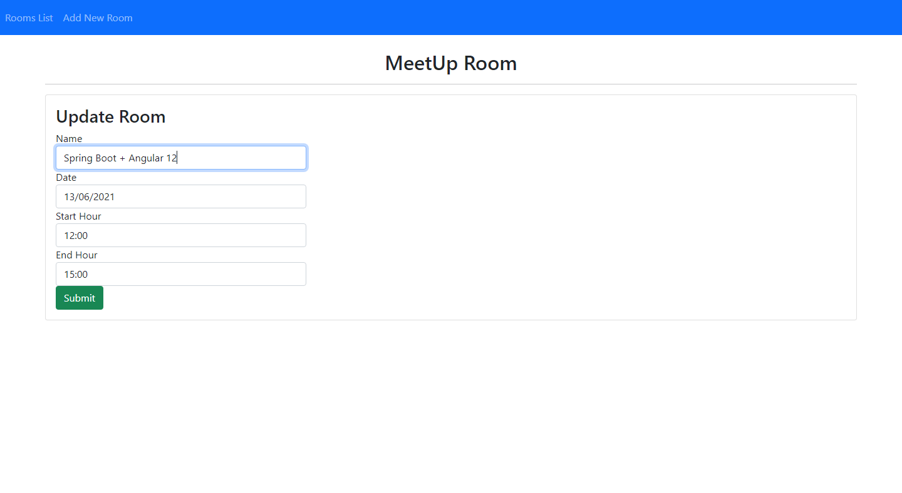

<p align="center">
  
</p>

<p align="center">
  <a href="#about">About</a>&nbsp;&nbsp;&nbsp;|&nbsp;&nbsp;&nbsp;
  <a href="#preview">Preview</a>&nbsp;&nbsp;&nbsp;|&nbsp;&nbsp;&nbsp;
  <a href="#technologies">Technologies</a>&nbsp;&nbsp;&nbsp;|&nbsp;&nbsp;&nbsp;
  <a href="#building">Building</a>&nbsp;&nbsp;&nbsp;|&nbsp;&nbsp;&nbsp;
  <a href="#contributing">Contributing</a>&nbsp;&nbsp;&nbsp;
</p>


## About
<strong>MeetUp Room</strong> is a API for managing meeting rooms.


## Preview
```
http://localhost:4200/api/v1/rooms
```
<p align="center">
  
</p>

```
http://localhost:4200/api/v1/add
```
<p align="center">
  
</p>

```
http://localhost:4200/api/v1/details/:id
```
<p align="center">
  
</p>

```
http://localhost:4200/api/v1/update/:id
```
<p align="center">
  
</p>


## Back-end Technologies
This project was developed using the following technologies:
- [Spring](https://spring.io/)
- [Java](https://www.oracle.com/br/java/technologies/javase-jdk11-downloads.html)
- [JPA + Hibernate](https://spring.io/projects/spring-data-jpa)


## Building
You'll need [Java 11+](https://www.oracle.com/br/java/technologies/javase-jdk11-downloads.html) and [Maven](https://maven.apache.org/download.cgi) installed on your computer in order to build this app.

```bash
$ git clone https://github.com/eric-souzams/meetup-room.git
$ cd meetup-room/backend
$ mvn spring-boot:run
```

## Front-end Technologies
This project was developed using the following technologies:

- [Angular 12](https://angular.io/)

## Building
You'll need [Node.js](https://nodejs.org) and [Npm](https://www.npmjs.com/) installed on your computer in order to build this app.

```bash
git clone https://github.com/eric-souzams/meetup-room.git
$ cd meetup-room/frontend
$ ng serve
```


## Contributing
This repository is currently under development. If you want to contribute please fork the repository and get your hands dirty, and make the changes as you'd like and submit the Pull request.